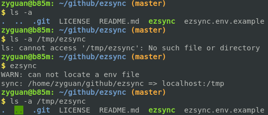
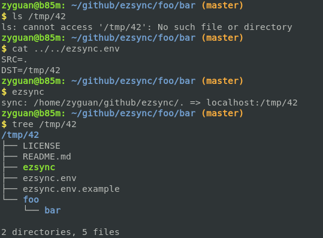

# ezsync

**ezsync** is a simple wrapper of `rsync` command for syncing your directory to multiple remote hosts easily. You can use a env file -- `ezsync.env`, to
define the behaviour of the script. `ezsync` will search for the env file in
current directory and all it's parents.

## Examples

When `ezsync.env` is missing, current working directory will be sync to `localhost:/tmp`.

You can perform sync in any subdirectories of your project by putting the env file to your project root directory.

